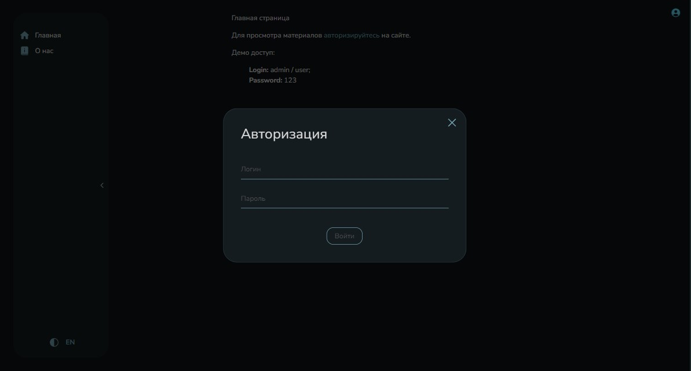
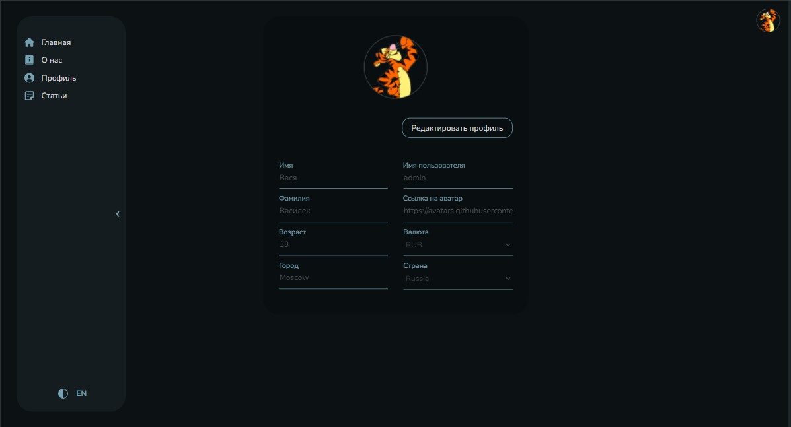
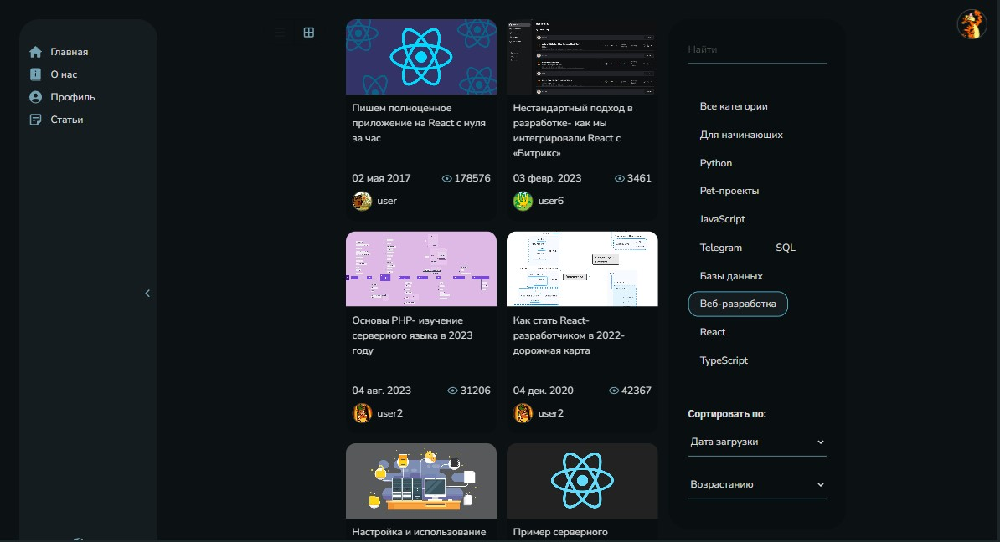
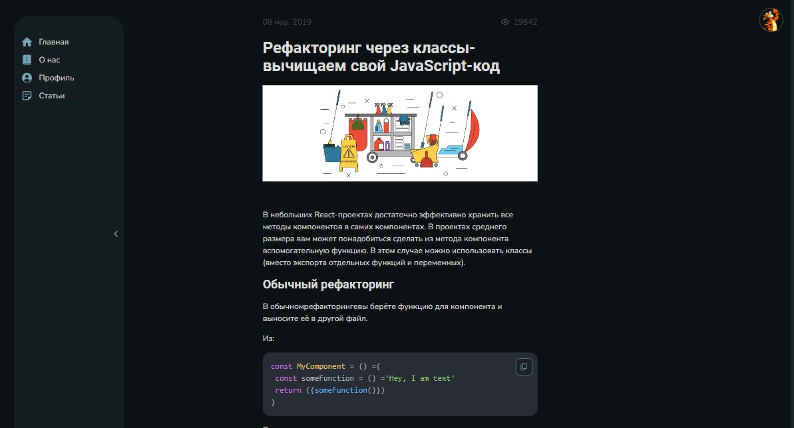
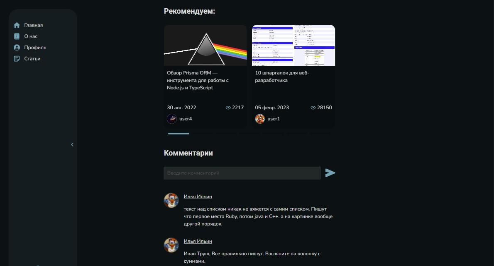

# Веб-приложение «Блог»

Учебный проект.

Реализованы следующие фичи:

- библиотека компонентов + storybook stories
- автогенерация статей для json-server
- авторизация c JWT механикой
- редактирование авторизованного пользователя
- для форм - управление фокусом с клавиатуры
- переключение темы (3 цвета)
- переключение языка (2 языка)
- роутинг
- нормализация данных для статей и пользователей (EntityAdapter)
- список статей:
  - выбор категориии
  - переключение вида отображения - список / колонки
  - сортировка по дате загрузки / количеству просмотров
  - отображение по возрастанию / убыванию
  - виртуальный список
  - ленивая подгрузка при скролле
  - сохранение позиции скролла
  - отображение скелетона во время получения данных
- статья
  - карусель с рекомендациями
  - обработка блоков кода
  - добавление и отображение комментариев

В проекте используются:

- методология [FSD](https://feature-sliced.design/ru/docs/reference/units/layers) для организация структуры папок проекта
- Typescript
- React, Redux Toolkit, RTK Query, React Hook Form, React Router, Zod
- SCSS, css modules
- Jest, React Testing Library, Storybook, Loki
- Webpack
- ESLint, Stylelint, Prettier, Lefthook
- Json-server

Ссылка на приложение - [Netlify](https://cap-bernardito-blog.netlify.app)







## Доступные команды

```bash
// Установка зависимостей
$ npm install

// Распаковка демо данных
$ npm run bootstrap

// Запуск проекта в режиме разработки
$ npm run start:dev

// Сборка проекта в папку `dist`
$ npm run build

// Запуск тестов
$ npm run test

// Запуск storybook для просмотра библиотеки компонентов
$ npm run storybook
```
